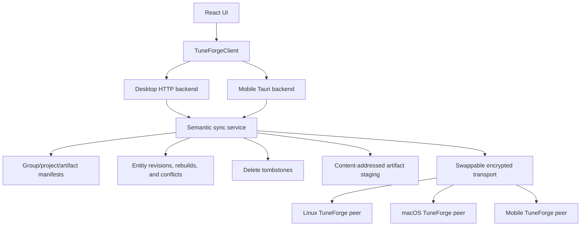

# Multi-Device Library Sync Spike

## Summary

This is an exploration report, not an implementation plan. The goal is to decide whether TuneForge should support a local-first sync group across multiple trusted installs: Linux desktop, macOS desktop, mobile, and future platforms where relevant.

The model should not be "mobile paired to one desktop." It should be "N trusted TuneForge installs in one sync group." Any peer can import tracks, edit durable project data after the project's minimum usable set is available and verified locally, generate artifacts, provide verified artifact bytes to other peers, go offline, and later catch up. Some peers are more capable than others, but no peer should be the permanent authority for the library.

This report assumes the mobile backend will converge with the desktop backend model: projects, jobs, artifacts, analysis, lyrics, chords, stems, exports, and sync-facing contracts should eventually have equivalent behavior even if the engines behind them differ by platform.

Remote processing is intentionally out of scope for the sync spike. It may become a separate capability scheduler later, but the sync model should not assume "mobile asks desktop" or any fixed executor relationship.

## Current State Findings

TuneForge is already oriented toward local-first library ownership at the product level. The repo documentation describes a local-first desktop app with no account or cloud requirement, mobile as an active Android-first companion path, and desktop-backed processing as a future direction for heavy work. The current mobile architecture documents a local mobile backend inside Tauri rather than exposing the desktop Python/FastAPI backend to Android.

The current desktop backend has the more complete library model:

- Projects live in SQLite and point at filesystem project roots under the configured data root.
- Project files are organized under `projects/<project_id>/source`, `analysis`, `previews`, `stems`, and `exports`.
- Desktop stores `source_sha256` on projects and `content_sha256` on artifacts in the database.
- Artifact rows include type, format, path, byte size, generated-by metadata, delete/regenerate flags, metadata JSON, and optional cache keys.
- The public API exposes project and artifact records, but it does not currently expose all sync-relevant fields such as `source_sha256`, `content_sha256`, `cache_key`, or job result artifact IDs.
- Project IDs are not normal library identity in the UI. They are implementation details that may appear in routes, APIs, storage paths, and diagnostics.

The current mobile backend is intentionally smaller:

- Mobile uses Tauri commands and an embedded SQLite database at app data root, not the desktop HTTP API.
- Mobile has project, artifact, job, analysis, chord, and lyrics tables, but its tables are not yet desktop-parity.
- Mobile imports Android `content://` and `file://` URIs into app-local storage.
- Mobile can run basic local analysis/chord paths and local Whisper lyrics when a side-loaded model exists.
- Mobile stems, preview, retune, transpose, and export are currently capability-gated or fail closed.
- Mobile currently reports `m4a` as default export/preview format, while desktop defaults to WAV and desktop stems are WAV-only.

The frontend already has a useful boundary for parity work. `TuneForgeClient` hides whether calls go to desktop HTTP or mobile Tauri commands, so sync-facing APIs should also flow through that boundary once they exist.

The UI has no global toast or notification system today. Status appears inline in panels, diagnostics, project job history, and compact sidebar surfaces such as background playback. Sync UX should start with those patterns before adding a broader notification system.

## Product Direction

The primary goal is multi-device library sync: keep durable TuneForge project libraries available across trusted installs in the same sync group.

Useful v1 behavior should be:

- A user imports a track on Linux desktop and sees it appear on macOS desktop after both installs are in the same sync group.
- A user imports a track on macOS desktop and sees the synced project appear on Linux desktop and mobile.
- A group can contain at least three peers, for example macOS desktop, Linux desktop, and Android mobile.
- Any two online peers can continue syncing while a third peer is offline.
- Source audio, generated stems, saved mixes, exports, lyrics, chords, analysis, and sections sync as library data.
- Rebuilding chords, lyrics, stems, mixes, or other generated library outputs on one peer creates new durable library state that syncs to the other peers.
- Deleting a project, stem, mix, export, or other synced library artifact on one peer should delete it from the sync group, not only from that local device.
- Importing the same source track by SHA-256 into a library that already has it should fail hard with an "already imported" message and a pointer to the existing project.
- App preferences, theme, local playback defaults, device settings, local model paths, acceleration preferences, and local debugging state do not sync.
- Mobile joins the same sync group as a normal peer, with constrained runtime capabilities but without a special mobile-to-desktop library model.
- Mobile can play synced desktop WAV artifacts directly when those artifacts are present locally.

Remote processing should not be part of v1 sync. If it is revisited later, it should be a separate capability scheduler that can choose the best available executor, not a hard-coded mobile-to-desktop bridge.

## What "Library" Means

With backend parity assumed, the syncable library should include durable project data:

- Project records: canonical project ID, display name, source key override, duration, sample rate, channels, timestamps, source hash, and project revision metadata.
- Source files: original imported source plus any normalized working source required by the receiving runtime.
- Artifacts: source audio, stems, saved practice mixes, previews, exports, analysis JSON snapshots, and future timing artifacts.
- Analysis: key, tuning, tempo, timing grids, source artifact link, analysis version, and timestamps.
- Chords: generated source segments, edited timeline, backend metadata, source kind, source artifact link, revision metadata, and user-edit flag.
- Lyrics: generated source segments, edited segments, backend/model metadata, source artifact link, revision metadata, and user-edit flag.
- Sections and accepted tab-assisted corrections where they become durable library data.
- Job history as historical status, not as active work to resume on another device.

The library should exclude local app state:

- Settings snapshots and preferences.
- Theme and appearance choices.
- Per-project playback memory stored in local frontend state.
- Device audio configuration, mic/input state, and native audio diagnostics.
- Cached model files and machine-local acceleration settings.
- Local-only capability configuration, such as GPU/CPU preferences, model paths, or mobile storage limits.

In-progress jobs should not be synced as runnable jobs. A receiving device can display that another device is processing something, but only completed outputs should become durable synced library state.

## Identity, Existing Projects, And Migration

The UI does not treat project IDs as user-facing library identity, but project IDs do appear in routes, APIs, paths, diagnostics, foreign keys, and manifests. Keeping a second project identity would make the sync model harder to reason about. V1 sync therefore makes the database/API `project_id` the canonical sync identity.

Canonical project identity is derived from the source track SHA-256:

- `project_id`: deterministic database/API identity derived from the full SHA-256 of the canonical imported source bytes, for example `proj_sha256_<full_sha256_hex>`.
- `project_storage_key`: short storage directory key derived from the same hash, for example `proj_<first_24_sha256_hex>`.
- `source_sha256`: full SHA-256 of the canonical imported source bytes.
- `artifact_id`: stable artifact record identity. It can be deterministic where practical from project ID, artifact type, source artifact relation, generation parameters, and content hash, but replacement/regeneration semantics should be explicit.
- `content_sha256`: full SHA-256 of the artifact bytes for verification and dedupe.
- `entity_revision`: durable revision metadata for editable or regenerable entities such as project metadata, chords, lyrics, and sections.

The full source hash remains in the database/API identity for collision detection and verification. The shorter storage key is only an implementation detail for local project folders and compact relative paths.

Existing libraries may contain random project IDs. The migration is best-effort: TuneForge attempts to compute source hashes, re-key safe projects to canonical IDs, rewrite project foreign keys, and move project folders to the derived storage key. If the original source is missing, duplicate source hashes exist, or a path conflict makes re-keying unsafe, the project can remain on a legacy ID and sync preflight will require cleanup or re-import before sync is enabled.

Expected migration flow before enabling sync:

1. Scan existing projects.
2. Ensure every project has `source_sha256`; compute it from the canonical imported source bytes if missing.
3. Detect duplicate `source_sha256` values in the local library.
4. If duplicates exist, fail migration and require manual cleanup before enabling sync. The user can delete a duplicate project and import it again later if needed.
5. Re-key each safe project to `project_id = proj_sha256_<full_source_sha256>` and move its folder to `proj_<first_24_source_sha256_hex>`.
6. Add a uniqueness constraint or equivalent guard for `source_sha256` in sync-enabled libraries.
7. Only enable sync after the migration has completed without unresolved missing hashes, duplicates, or legacy project IDs.

Import behavior should be strict:

- If the local library already has the same `source_sha256`, import should fail hard with a message such as: `You already have project "<project name>" imported.`
- If the sync group manifest already knows the same canonical project ID, import should fail or redirect to the existing synced project rather than creating a duplicate.
- V1 should not support intentional same-source duplicate projects or variants. If the user wants to reset a project, they can delete it from the library and import it again.
- The project ID must be based on the original source bytes, not a platform-specific normalized WAV proxy, otherwise macOS, Linux, and mobile could derive different sync IDs for the same import.
- Hash prefixes must not be the only stored identity. Prefixes are acceptable for display, logs, or compact filenames only if the implementation retains the full hash for collision detection and verification.

Tradeoffs:

- Byte-identical source imports naturally converge to the same sync project.
- The same song encoded in different containers or bitrates will not dedupe unless a future audio fingerprinting layer is added.
- Existing random project IDs are allowed only as migration leftovers that must be cleaned up before sync is enabled.
- The no-duplicates rule keeps v1 simple, but it rules out multiple independent arrangements from the exact same source until a future explicit variant model exists.

Implementation decision for the first sync milestone:

- Desktop backend imports now use canonical `project_id = proj_sha256_<full_source_sha256>`.
- Project directories use the shorter derived storage key instead of the full project ID.
- `GET /api/v1/sync/preflight` checks existing libraries for missing hashes, invalid hashes, duplicate source hashes, and noncanonical project IDs before sync is enabled.
- Duplicate import rejection is enforced for backend imports because the canonical project ID makes same-source duplicates a primary-key conflict.

## Storage And Portability

Direct database sync is the wrong primitive. Desktop and mobile schemas are not identical today, and even after parity, SQLite files contain local paths, migrations, and runtime-specific state. Sync should operate through manifests and artifact content.

The portable unit should be a sync group manifest plus project manifests and content-addressed files:

- `sync_group_manifest`: sync group ID, schema version, known devices, known projects, group-level feature flags, delete tombstone summary, and high-water marks.
- `device_manifest`: device ID, display name, platform, public identity, protocol versions, advertised capabilities, last-seen metadata, and trust state.
- `library_manifest`: local device ID, schema version, known sync projects, available artifacts, group delete tombstones, and high-water marks.
- `project_manifest`: canonical project ID, local display/project metadata, analysis/chords/lyrics/sections records, artifact list, revision records, and dependency links.
- `artifact_manifest`: artifact ID, canonical project ID, type, format, relative project path, byte size, SHA-256, generated-by metadata, can-delete/can-regenerate flags, metadata, cache key when meaningful, source artifact relation, and replacement/supersession state.
- `peer_inventory`: per-device advertisement of which content hashes and artifact bytes are currently available, transferring, or missing.
- `entity_revision`: durable entity type, entity ID, revision ID, base revision ID, author device ID, logical counter or monotonic sequence, updated timestamp, generation metadata when relevant, and content hash.
- `delete_tombstone`: durable record for group-level deletion of a project, artifact, or entity revision.
- `transfer_manifest`: chunk/block hashes for large files, transfer state, provider device, receiver device, and verification results.

Receivers should rewrite all file paths to their own app data root. Paths in sync manifests should be relative to the project root. Absolute source paths can remain as display/provenance metadata, but they must not be required for playback or regeneration on another device.

The current hash fields are valuable but need to move into the sync contract. Desktop already stores source and artifact hashes in the database; public schemas should expose sync-safe hash fields, and mobile parity should store the same information.

Content identity and semantic identity should remain separate:

- Sync project identity comes from source SHA-256.
- Artifact record identity comes from sync project context, artifact role, generation parameters, and content identity.
- `content_sha256` remains the content identity for byte-for-byte dedupe and verification.
- Optional transport-specific content IDs, such as BLAKE3 blob IDs, may be used internally by the transfer layer but should not replace the sync contract's stable SHA-256 fields.
- Provider inventory should be treated as an advertised availability snapshot, not as artifact truth. It can be stale, and receivers must still verify received bytes by SHA-256 before import.

Conflict handling should be conservative:

- If two devices have the same sync project/artifact ID and same SHA-256, treat it as identical.
- If the same content arrives under different artifact IDs, dedupe by SHA-256 where metadata allows it.
- If lyrics, chords, or sections diverge from the same base revision, keep both and mark a conflict instead of overwriting user edits.
- If generated artifacts diverge because two peers rebuilt them concurrently or with different engines/models, keep both or mark a replacement conflict instead of assuming determinism.
- Entity-level conflicts should use revision ancestry, not only wall-clock timestamps.

Delete behavior should be group-oriented for v1:

- Deleting a project means deleting it from the sync group.
- Deleting a stem, saved mix, export, or generated artifact means deleting that artifact from the sync group.
- Delete operations should create durable tombstones so offline peers do not resurrect deleted records when they reconnect.
- Tombstones should include author device, timestamp, target ID, target type, and enough prior metadata to make UI diagnostics possible.
- Local-only artifact eviction can be deferred. For v1, a visible delete action should mean group delete, not "free local space only."

## Sync Completeness And Edit Locking

Avoid making partially synced projects editable. Metadata can arrive first so the project appears in the remote library, but the receiving app should treat that project as `syncing` and read-only until the minimum usable project set has been verified locally.

Minimum usable set for v1:

- Project manifest.
- Source artifact manifest.
- Source bytes or a verified playable/analysis-compatible source proxy.
- Editable entities with their base revisions, such as lyrics/chords/sections when present.
- Current conflict state.
- Relevant delete tombstones known to the receiving peer.

For the first user-focused version, TuneForge can prioritize full-library sync over selective mobile storage. Large generated artifacts can still have transfer states, but the default product expectation is that synced library artifacts eventually arrive on all trusted peers unless deleted from the group.

Suggested availability states:

- `syncing`: metadata or required bytes are still arriving; project is visible but not editable.
- `local`: required project data and the artifact bytes are present and verified locally.
- `remote_available`: artifact bytes are available from at least one trusted peer but not local yet.
- `downloading`: transfer is in progress.
- `missing`: metadata references bytes that no trusted peer currently advertises.
- `deleted`: the project, artifact, or entity has a group tombstone.
- `conflicted`: semantic metadata requires user review.

The important UX rule is that "metadata-only" should not become "editable project." It should appear as a syncing or unavailable project row until the app can safely open it.

## Regeneration And Delete Semantics

TuneForge should not assume generated data is deterministic across devices, hardware, model versions, or future engine changes. Even if some generation paths happen to be deterministic today, sync should record what actually happened.

Regeneration rules:

- Rebuilding chords creates a new chord entity revision with generation metadata, source artifact relation, author device, and content hash.
- Rebuilding lyrics creates a new lyrics entity revision with backend/model metadata, source artifact relation, author device, and content hash.
- Rebuilding stems, mixes, previews, or exports creates new artifact state with generation metadata, source artifact relation, author device, byte size, and `content_sha256`.
- If regenerated output has the same SHA-256 as the existing output, it can dedupe and remain semantically identical.
- If regenerated output differs, the new output should sync as the current replacement when the user explicitly ran a rebuild/replace operation.
- If two peers rebuild the same entity or artifact concurrently from the same base, the receiver should mark a conflict or keep both branches rather than guessing which is correct.
- Receiving peers should import regenerated lyrics/chords/artifacts as synced library state. They should not be required to rerun the local engine just because the output is cheap to regenerate.

Delete rules:

- Project delete removes the project, source, generated artifacts, and durable metadata from the sync group through a group tombstone.
- Artifact delete removes the artifact from the sync group through an artifact tombstone.
- Rebuild-and-replace should supersede old generated outputs and may tombstone replaced artifact/entity revisions if the product does not want to keep history.
- Rebuild-and-keep-both can be a future explicit feature, but v1 should prefer simple replacement semantics unless there is a conflict.
- Delete tombstones must be reconciled before accepting older manifests, otherwise offline devices may resurrect removed projects or artifacts.

## Format Policy And Mobile WAV Impact

Mobile should support desktop WAV artifacts because desktop stems are already WAV-only and WAV is the safest interchange format for generated stems and analysis-ready audio. Not supporting WAV would make mobile unable to consume the most important desktop-generated artifacts.

Using WAV has tradeoffs beyond file size:

- Android platform media support includes PCM/WAVE decode for common linear PCM WAV files, but TuneForge should validate the exact desktop stem format.
- If desktop-generated stems use 24-bit PCM, 32-bit float WAV, unusual channel layouts, or RF64/BWF variants, mobile playback may need the app's native decoder path rather than relying only on platform media APIs.
- PCM/WAV generally avoids compressed-codec decode work, but it reads and transfers far more bytes than AAC/M4A or MP3.
- Larger reads can increase storage I/O, cache pressure, sync time, and network/battery cost during transfer.
- Compressed formats may use hardware decode or offloaded playback on some devices, so WAV is not automatically better for battery life during playback.
- For practice features that need sample-accurate stems, analysis, or low-latency PCM buffers, WAV/PCM can still be the simpler and more reliable working format.
- Actual battery impact needs measurement on target Android hardware because it depends on storage, output path, codec/offload support, sample rate, and whether playback is through MediaCodec, AudioTrack, or the app's native audio path.

Recommended policy:

- Preserve the original imported source when possible.
- Store generated stems and desktop-produced practice artifacts as WAV when that is the canonical artifact format.
- Generate derived WAV/PCM proxies only when needed for playback, analysis, waveform, or ML paths.
- Keep source artifact metadata explicit about original format, canonical playback path, analysis path, and generated proxy path.
- Treat AAC/M4A as mobile export-oriented formats, not as the only internal mobile format.
- For the first user-focused sync version, prioritize correctness and full-library availability over mobile storage optimization.
- Let mobile avoid opening or editing a project until the required base data is synced, but do not make selective mobile storage a first-order v1 requirement.

Desktop can later adopt the same storage model: original source as canonical import, normalized WAV as a disposable derived cache where possible, and durable generated artifacts when they are user-visible library outputs.

## Architecture Options

### TuneForge Semantic Sync Layer

TuneForge owns project manifests, artifact manifests, revision records, pairing/trust semantics, conflict rules, tombstones, staged import/export, status UX, and future remote-processing integration. The transport underneath can be custom or library-backed.

Benefits:

- Best fit for project/artifact semantics.
- Can exclude preferences and local app state by construction.
- Can model generated artifacts, user edits, conflict branches, canonical project IDs, and group delete tombstones explicitly.
- Works across Linux, macOS, mobile, and future platforms without syncing raw database files.
- Allows transport choices to change without changing the library contract.

Costs:

- More engineering work than wrapping an existing file sync tool.
- Must get identity, encryption, resumability, conflict safety, staged imports, edit locking, and delete propagation right.
- Needs careful test coverage for partial transfer, corruption, replay, path rewriting, multi-peer conflicts, and offline tombstone reconciliation.

This is the recommended product direction. Syncthing should be used as a design reference, not as the product boundary.

### Custom LAN Transport Baseline

TuneForge implements a simple native transport for the first spike: pinned device identity, local discovery, encrypted streams, manifest exchange, chunked blob transfer, resume, hash verification, and status events.

Benefits:

- Smallest conceptual surface for proving the semantic sync model.
- Keeps implementation close to TuneForge's actual requirements.
- Good benchmark for evaluating external transport libraries.
- Can start with same-LAN desktop-to-desktop sync before mobile complexity.

Costs:

- NAT traversal, relay fallback, and broader connectivity are non-trivial if needed later.
- Requires implementation and testing of resumability and transfer scheduling.
- Could duplicate functionality already available in mature peer-to-peer libraries.

This is a good control implementation for the first spike, even if it is replaced later.

### Iroh-Based Transport And Blob Layer

TuneForge uses Iroh for peer connectivity and/or content-addressed blob transfer while keeping TuneForge manifests as the semantic source of truth.

Benefits:

- Rust-native peer-to-peer transport model.
- QUIC streams can carry TuneForge-specific protocols.
- Content-addressed blob transfer maps well to source files, WAV stems, exports, previews, and analysis snapshots.
- Blob integrity verification and range/streaming transfer are directly relevant to large audio artifacts.
- Avoids adopting a generic folder-sync model as the product semantics.

Costs:

- Requires spike work for Tauri desktop and Android integration.
- Transport-specific hashes, such as BLAKE3 blob IDs, must coexist cleanly with TuneForge's SHA-256 sync contract.
- Relay policy, dependency maturity, lifecycle handling, and offline behavior need evaluation.

This is the strongest candidate for a TuneForge-owned multi-device sync transport.

### Ouisync-Based Managed Sync Substrate

TuneForge evaluates Ouisync as a managed peer-to-peer sync substrate for a TuneForge-owned sync repository containing manifests and content-addressed blobs, not raw app data.

Benefits:

- Designed as a secure peer-to-peer file sync app/library.
- Has Rust implementation and mobile-relevant bindings.
- Already targets multi-device peer-to-peer file synchronization across desktop and mobile platforms.
- Could reduce the amount of custom networking and repository synchronization code.

Costs:

- Ouisync is still file/repository oriented, not TuneForge project semantics.
- Its own repository/conflict model may or may not fit TuneForge's staged import/export model.
- Packaging, lifecycle, permissions, storage behavior, and dependency license policy need explicit evaluation.
- TuneForge would still need semantic manifests, path rewriting, revisions, edit locking, delete tombstones, and artifact import rules.

This is worth a serious spike, especially as a comparison against Iroh and the custom baseline.

### Managed Syncthing Sync Bundle

TuneForge manages or guides a Syncthing-style folder containing only sync-safe data: group manifests, project manifests, revision records, tombstones, and content-addressed blobs. It must not sync the raw app data directory or SQLite database.

Benefits:

- Syncthing has proven concepts for device identity, TLS, block exchange, local discovery, resumable file sync, and multi-device folder clusters.
- Strong mental model for desktop users who already trust Syncthing.
- Existing REST and status concepts are useful for UX inspiration.
- Desktop-to-desktop sync across Linux and macOS is close to Syncthing's core strength.

Costs:

- Syncthing is file/folder sync, not TuneForge project semantics.
- Raw folder sync does not solve SQLite path rewriting, edit locking, user-edit conflicts, rebuild semantics, or group delete tombstone interpretation.
- The sync bundle would still need TuneForge manifests and staged imports.
- Runtime distribution, licensing, packaging, and lifecycle management need explicit review.
- Mobile packaging and lifecycle management may be harder than desktop packaging, especially because the official Syncthing Android wrapper has been discontinued.

This option is worth evaluating as a desktop-focused comparison, but it should not become "sync the TuneForge data directory with Syncthing."

### External Syncthing Integration

TuneForge detects or documents an existing Syncthing setup and exposes import/status affordances around a user-managed sync bundle.

Benefits:

- Minimal protocol work.
- Useful for advanced users who already sync folders between Linux and macOS.
- Can provide a bridge while native sync matures.

Costs:

- Weak product UX for mobile and non-technical users.
- Hard to guarantee that only library data syncs.
- Still does not solve database portability, path rewriting, edit locking, delete semantics, or semantic conflicts unless the synced folder is a TuneForge sync bundle.
- External setup varies across macOS, Linux, Android, and other platforms.

This is better as an advanced compatibility path than the primary product strategy.

### Platform Discovery And Pairing Helpers

Android Network Service Discovery, Tauri barcode scanning, mDNS/DNS-SD, and platform-specific mechanisms can help with pairing and discovery.

Benefits:

- Useful for QR pairing, local discovery, and nearby-device flows.
- Android-specific discovery APIs may simplify some mobile cases.
- Can improve UX without defining the core sync semantics.

Costs:

- Platform-specific APIs do not solve cross-platform Linux/macOS/mobile sync by themselves.
- Discovery APIs are not a full TuneForge semantic sync system.
- Pairing/discovery must not be treated as authentication.

These mechanisms should be evaluated as discovery and pairing aids, not as the core product protocol.

## Recommended Direction

Build a TuneForge-owned semantic sync layer with a swappable transport/blob layer. The sync layer should operate above backend persistence and below UI workflows. It should treat Linux desktop, macOS desktop, and mobile as peers in the same trusted sync group.

The first real implementation milestone should be library sync between two desktop installs, ideally Linux and macOS. The next milestone should add a third peer and prove that any two online peers can continue syncing while the third is offline. Mobile should join after the desktop-to-desktop semantic model is proven, with the same library model and measured WAV playback behavior. Remote processing should remain decoupled from the sync spike.

Recommended spike sequence:

1. Existing-library migration preflight: compute missing source hashes, detect duplicate source hashes, re-key safe projects to canonical IDs, and fail hard if manual cleanup is required.
2. Manifest-only desktop project export/import with path rewriting and hash verification.
3. Strict duplicate import behavior based on source SHA-256.
4. Content-addressed artifact staging and idempotent import.
5. Entity revision records for project metadata, chords, lyrics, sections, and regeneration events.
6. Group delete tombstones for project/artifact/entity deletion.
7. Edit-locking for syncing projects until minimum usable data is verified.
8. Linux-to-macOS desktop sync on the same LAN.
9. Three-peer desktop sync behavior.
10. Transport bake-off: custom LAN baseline, Iroh, Ouisync, and possibly a Syncthing-managed sync bundle.
11. Mobile library sync and WAV playback/battery validation.

## Security Model

The security bar should be "local-first, explicit trust, encrypted by default."

Sync group identity:

- A sync group has a stable `sync_group_id`.
- Devices join a sync group through explicit trust establishment.
- V1 can support a single sync group per install even if the data model leaves room for multiple groups later.

Device identity:

- Each install generates a long-lived local keypair.
- The public identity derives a stable device ID.
- Pairing stores the peer's device ID and public identity.
- Trust is explicit and revocable.
- Device display names are convenience labels, not identity.
- Trust should be pairwise in v1. Joining the same sync group should not automatically grant transitive trust. A device may announce that it knows another peer, but each receiving install should explicitly trust that peer before accepting manifests, revisions, tombstones, or artifact bytes from it.

Pairing:

- QR code should be the primary mobile pairing flow.
- Desktop-to-desktop can use local discovery to find candidates, but still requires explicit confirmation.
- Desktop-to-desktop should also support a manual code or copy/paste pairing path for networks where discovery is unavailable.
- Pairing payload should include sync group ID, device ID, display name, endpoint hints, protocol version, and a short-lived pairing secret or confirmation code.

Transport and manifest authenticity:

- Use encrypted peer-to-peer transport with pinned peer identity.
- Discovery announces candidates, not trust.
- Verify every received artifact by SHA-256 before importing it.
- Use chunk/block hashes or transport-level verified streaming for large artifacts and resumable transfers.
- Include nonces/session IDs to avoid replaying stale transfer messages.
- Manifests, entity revisions, and delete tombstones should carry author device metadata and should be signed by the author device or otherwise authenticated with a group/pairing key, especially if TuneForge ever supports a Syncthing-managed or externally synced bundle.
- Keep the existing FastAPI backend loopback-only; LAN exposure belongs in a separate native sync layer.

LAN discovery:

- Syncthing local discovery is a useful reference for announcing device IDs and addresses over a LAN.
- Android NSD provides local service discovery APIs and should be evaluated for mobile-friendly discovery.
- QR/manual pairing must work even when LAN discovery is unavailable.

Risks:

- Local discovery spoofing is possible if discovery is treated as authentication. It must not be.
- A compromised paired device can send bad metadata unless manifests are validated strictly.
- Automatic group delete propagation can cause data loss if tombstones are accepted too broadly or without user intent.
- Sync group membership revocation needs careful behavior for devices that were offline during revocation.
- Public backend binding would violate the current trust boundary. Keep FastAPI loopback-only and put LAN exposure in the native sync layer.

## Data Sync Model

Sync should be content-aware, project-aware, and group-aware:

1. Create or join a sync group.
2. Run migration preflight before enabling sync on an existing library.
3. Pair devices and exchange identities, protocol versions, and basic platform capabilities.
4. Exchange library manifests and peer inventory.
5. Compare project revisions, entity revisions, artifact manifests, artifact hashes, and delete tombstones.
6. Create read-only syncing project placeholders where metadata has arrived but required base data is incomplete.
7. Queue missing metadata and files.
8. Choose a provider for each missing content hash from the set of trusted online peers.
9. Transfer files in chunks or verified streams with hash verification.
10. Stage incoming project data under a temporary path.
11. Import staged data through backend/mobile services so database rows and filesystem paths stay consistent.
12. Mark the project editable only after the minimum usable set is local and verified.
13. Apply regeneration revisions and delete tombstones through backend services, not raw database writes.
14. Update availability state and provider inventory.
15. Emit sync status events for UI.

Multi-peer behavior:

- No device should be treated as the permanent master.
- Any peer can introduce new project metadata, artifacts, user edits, rebuilds, or group delete tombstones when the relevant project is fully available locally.
- Any peer that has verified bytes can serve those bytes to another trusted peer.
- A device can be offline without making the sync group failed.
- A new peer should be able to catch up from whichever trusted peers are online and have the required data.

Conflict policy:

- Generated output conflicts can usually keep both artifacts or surface a replacement conflict.
- User-edited lyrics/chords/sections require explicit conflict UI.
- Project rename conflicts can use newest update while preserving alternate names in conflict metadata.
- Job history conflicts should not block sync because historical jobs are not authoritative library state.
- Entity-level conflicts should use revision ancestry, not only wall-clock timestamps.
- Delete tombstones should usually win over older manifests, but only after validating author identity, target identity, and sync group membership.

Offline and reconnect behavior:

- Devices keep a durable outbound/inbound sync queue.
- Completed transfers are idempotent by SHA-256.
- Partial transfers resume by chunk hash or verified range request where supported.
- A device can mark another as offline without marking sync failed.
- Manual "Sync now" should force manifest exchange and retry failed transfers.
- If a device misses multiple rounds of changes, it should reconcile from manifests, revisions, and tombstones rather than replaying fragile event logs.

## Remote Processing Boundary

Remote processing is not part of v1 sync.

If revisited later, it should be capability-based and scheduler-driven, not hard-coded as "mobile asks desktop." Different devices can have very different practical performance profiles: a fast Apple Silicon laptop may be a better executor than an older Linux GPU box even if both advertise stem capability. A later scheduler would need to account for capability, expected speed, current load, power state, user preference, and availability.

Future remote job research should answer:

- Whether remote processing is needed after library sync exists.
- Whether the user picks an executor or TuneForge chooses automatically.
- How devices advertise expected performance without creating confusing promises.
- Whether remote jobs can be canceled, retried, or reassigned.
- How returned outputs become normal artifacts through the sync layer.

For this spike, keep mobile "sync only" once backend parity exists.

## Frontend UX

Use existing TuneForge UI patterns first.

Settings:

- Add a "Sync Group" or "Connected Devices" section near Local Data.
- Show this device name, device ID, and sync group ID.
- Do not expose local `project_id` as a normal user-facing concept.
- Actions: create sync group, join sync group, show QR code, scan QR code on mobile, discover nearby devices, copy pairing code, unpair device, pause sync, sync now.
- Show migration/preflight status before sync is enabled on an existing library.
- Show per-device status: online, last seen, last sync, pending transfers, paused, conflict count.
- Show group-level state: all synced, syncing, partial availability, conflicts, offline peers.

Library:

- Add a compact sync summary near the library toolbar.
- Show global state such as "All synced", "2 peers online", "3 transfers pending", "Waiting for MacBook", "Artifacts available remotely", or "2 conflicts".
- Avoid turning the library into a sync dashboard.
- Allow syncing projects to appear, but keep them visually distinct and non-editable until required data is verified.
- When importing a track whose source SHA-256 already exists, show a hard failure such as: `You already have project "<project name>" imported.` The UI should offer to open the existing project, not create a duplicate.

Project:

- Add project-level sync state near existing job/status surfaces.
- Show artifact-level availability for large files: local, remote, downloading, missing, deleted.
- Show artifact-level progress for large transfers only when relevant.
- Disable edits while the project is still syncing its minimum usable set.
- Link conflicts to the affected lyrics/chords/sections/artifacts.
- Rebuild actions for chords, lyrics, stems, mixes, previews, and exports should make clear that rebuilt outputs become synced library state.
- Delete actions should make clear that deleting a synced project or artifact deletes it from the sync group, not just from the current device.

Notifications:

- Start with inline `role="status"` regions and compact app chrome indicators.
- Add a small in-app notice system only if background sync needs global completion/failure feedback while the user is outside the relevant project.
- System notifications should not be part of the first sync spike.

## Validation Plan

For the eventual implementation spike, validate in this order:

1. Existing-library migration tests for projects with random IDs, missing source hashes, duplicate source hashes, and successful canonical project ID assignment.
2. Manifest tests for desktop project export/import, path rewriting, hashes, and dedupe.
3. Deterministic canonical project ID tests from full source SHA-256.
4. Duplicate import tests proving same-source imports fail hard and point to the existing project.
5. Staged import tests proving that synced data is imported through backend services rather than raw database writes.
6. Entity revision tests for chords, lyrics, sections, project renames, base revision tracking, rebuild events, and conflict branches.
7. Delete tombstone tests for project deletes, artifact deletes, offline-peer delete reconciliation, and resurrection prevention.
8. Edit-lock tests proving syncing projects are visible but not editable until required base data is present.
9. Pairing tests for QR/manual payload validation, trust storage, unpairing, invalid peer rejection, pairwise trust, and sync group ID handling.
10. Transfer tests for chunk verification, partial resume, corruption rejection, provider switching, and idempotent replays.
11. Conflict tests for edited lyrics/chords/sections, project rename conflicts, concurrent rebuilds, delete-vs-update races, and divergent generated artifacts.
12. Artifact availability tests for local artifacts, remote artifacts, missing providers, deleted artifacts, and transfer state.
13. Frontend tests for Settings pairing UI, migration/preflight status, duplicate import failure, library status, project sync status, artifact availability, conflict surfacing, edit disabling, group delete warnings, and accessible status updates.
14. Transport bake-off tests comparing custom LAN baseline, Iroh, Ouisync, and possibly a Syncthing-managed sync bundle.
15. Mobile WAV validation:
    - WAV source/stem playback works from synced desktop artifacts.
    - Battery and CPU usage are measured against AAC/M4A or another compressed baseline.
    - Storage and transfer costs are visible in the sync UI.
    - Playback does not require special mobile-to-desktop sync semantics.
16. Manual multi-device tests:
    - Linux desktop to macOS desktop on the same LAN.
    - macOS desktop to Linux desktop on the same LAN.
    - Three peers in one group, such as Linux desktop, macOS desktop, and mobile.
    - One peer offline while the other two continue syncing.
    - Offline import then reconnect.
    - Same source imported independently on two devices and merged or rejected by source hash according to manifest state.
    - Duplicate local imports fail hard with the existing project name.
    - WAV stem sync to mobile playback.
    - Rebuilt chords/lyrics on one peer sync to the other peers.
    - Deleted projects/artifacts on one peer are deleted from all peers after reconnect.
    - Conflicting lyric/chord edits on two fully synced devices.

## Open Questions

- Should v1 sync job history at all, or only current durable outputs and metadata?
- How long should delete tombstones be retained?
- Should TuneForge support undo for group deletes, and if so, how does that interact with offline peers?
- Should source imports always copy into the project for syncable projects?
- How should future intentional same-source variants be represented if the v1 policy forbids duplicates?
- Which transfer implementation is best for Tauri desktop and Android: custom LAN QUIC/TLS, Iroh, Ouisync, Syncthing-managed sync bundle, WebRTC data channels, or managed local HTTP over a pinned encrypted tunnel?
- If a transport uses BLAKE3 or another internal content hash, how should that coexist with TuneForge's SHA-256 artifact hashes?
- Does embedding or managing any Syncthing/Ouisync component satisfy dependency/license policy?
- Should mobile storage pruning or local-only eviction exist later, or is full-library sync good enough for the expected personal library size?
- Should a sync group support multiple libraries in the future, or is one library per app install enough?
- Is relay/NAT traversal required for v1, or should v1 be same-LAN only?
- How should sync group membership revocation work when a revoked device was offline?

## Primary Sources

Repo docs:

- [SPEC.md](./SPEC.md)
- [MOBILE.md](./MOBILE.md)
- [API.md](./API.md)
- [ROADMAP.md](./ROADMAP.md)

Repo implementation:

- `apps/backend/app/models.py`
- `apps/backend/app/services/projects.py`
- `apps/backend/app/services/artifacts.py`
- `apps/backend/app/services/paths.py`
- `apps/desktop/src/lib/api.ts`
- `apps/desktop/src-tauri/src/mobile_backend.rs`
- `apps/desktop/src-tauri/src/native_audio/decode.rs`

External references:

- Syncthing Block Exchange Protocol: <https://docs.syncthing.net/specs/bep-v1.html>
- Syncthing Device IDs: <https://docs.syncthing.net/dev/device-ids.html>
- Syncthing Local Discovery: <https://docs.syncthing.net/specs/localdisco-v4.html>
- Syncthing REST API: <https://docs.syncthing.net/dev/rest.html>
- Iroh protocol docs: <https://docs.iroh.computer/concepts/protocols>
- Iroh blobs protocol: <https://docs.iroh.computer/protocols/blobs>
- Ouisync project: <https://github.com/equalitie/ouisync>
- Ouisync developer docs: <https://ouisync.net/developers/>
- Tauri Barcode Scanner plugin: <https://v2.tauri.app/plugin/barcode-scanner/>
- Android supported media formats: <https://developer.android.com/media/platform/supported-formats>
- Android `AudioTrack`: <https://developer.android.com/reference/android/media/AudioTrack>
- Android Network Service Discovery: <https://developer.android.com/develop/connectivity/wifi/use-nsd>
